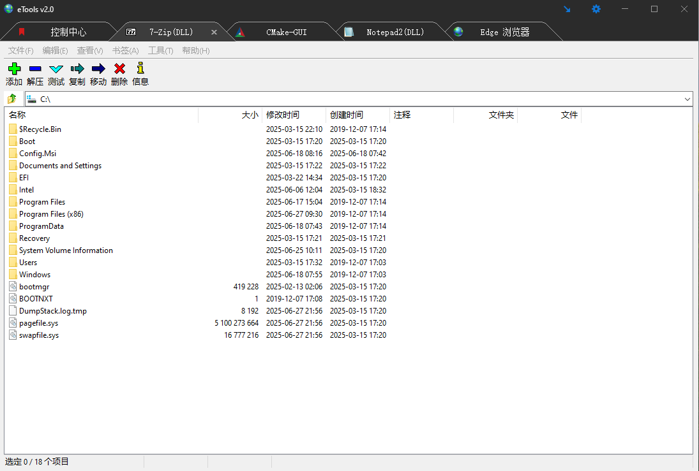

eTools
=============

# eTools 是一个基于 DLL 动态库窗体的，多文档的，模块化开发平台

- [English](readme.md)

## 一：开发宗旨
    本着尽量少修改或不修改原有工程(EXE)源代码(Delphi、VC、QT)的原则;
    支持 Delphi DLL 窗体、VC DLL 窗体(Dialog/MFC)、QT DLL 窗体; 

## 二：开发平台
    Delphi12.3、WIN10X64 下开发；
    WIN10X64下测试通过；支持X86、X64；
    邮箱：dbyoung@sina.com；
    QQ群：101611228；

## 三：功能
    支持 Delphi 窗体 DLL；
    支持 VC Window32 窗体 DLL；
    支持 VC MFC 窗体 DLL；
    支持 QT 窗体 DLL；
    支持将一个 EXE 窗体程序显示在我们的程序中；
    支持窗体类名动态变化的 EXE、DLL 窗体 程序；支持多文档窗体；
    支持 x86 EXE 调用 x64 EXE，x64 EXE 调用 x86 EXE；
    界面为暗黑风格，保护视力；
    
## 四：使用方法
### Delphi：
* Delphi 原 EXE 工程文件，修改为 DLL 工程。输出导出函数就可以了，原有代码不用作任何修改；
* 把编译后的 DLL 文件放置到 plugins 目录下就可以了；
* 示例：module\Delphi；
* Delphi 导出函数声明：
```
type TLangStyle = (lsDelphi, lsVCDLG, lsVCMFC, lsQT, lsEXE);
procedure db_ShowDllForm_Plugins(var ls: TLangStyle; var frm: TFormClass; var strModuleName: PAnsiChar); stdcall;
```

### VC2022
* 将 VC 窗体 EXE 转换成 DLL，供其它语言调用: [https://blog.csdn.net/dbyoung/article/details/103987103]
* VC 基于对话框的EXE，不作任何修改。编译，得到 LIB、RES、OBJ 文件。新建 Dll.cpp 文件，输出导出函数，连接，得到 DLL 模块文件；
* VC 原基于MFC 的EXE，将 EXE 工程修改为 DLL 工程，需要少许修改；编译得到 DLL 模块文件；
* 把编译后的 DLL 文件放置到 plugins 目录下就可以了；
* 示例：module\vc；
* VC2022 导出函数声明：
```
enum TLangStyle {lsDelphi, lsVCDLG, lsVCMFC, lsQT, lsEXE};
extern "C" __declspec(dllexport) void db_ShowDllForm_Plugins(TLangStyle* lsFileType, char** strModuleName, char** strClassName, char** strWindowName, const bool show = false)
```

### QT
* QT 原 EXE，不作任何修改。编译，得到 LIB、RES、OBJ 文件。
* 新建 Dll.cpp 文件，输出导出函数就可以了；编译、连接得到 DLL 文件；
* 把编译后的 DLL 文件放置到 plugins 目录下就可以了；
* 其实和 VC Dialog DLL 方式一模一样，封装和调用；
* 示例：module\qt；
* QT 导出函数声明：
```
enum TLangStyle {lsDelphi, lsVCDLG, lsVCMFC, lsQT, lsEXE};
extern "C" __declspec(dllexport) void db_ShowDllForm_Plugins(TLangStyle* lsFileType, char** strModuleName, char** strClassName, char** strWindowName, const bool show = false)
```

## 五：Dll 输出函数参数说明
* Delphi ：
```
  procedure db_ShowDllForm_Plugins(var ls: TLangStyle; var frm: TFormClass; var strModuleName: PAnsiChar); stdcall;
 ls                  ：Dll 窗体类型；
 frm                 ：Delphi 中 DLL 主窗体类名；
 strModuleName       ：模块名称；
```
* VC2022/QT ：
```
extern "C" __declspec(dllexport) void db_ShowDllForm_Plugins(TLangStyle* lsFileType, char** strModuleName, char** strClassName, char** strWindowName, const bool show = false)

 lsFileType        ：Dll 窗体类型；是基于 Dialog(对话框) 的 DLL 窗体，还是基于 MFC 的 DLL 窗体，还是基于 QT 的 DLL 窗体；
 strModuleName     ：子模块名称；
 strClassName      ：DLL 主窗体的类名；
 strWindowName     ：DLL 主窗体的标题名；
 show              ：显示/隐藏窗体；
```

## 六：已知存在的BUG：
    1、文件拖放只能拖放到主窗体上，不能直接拖放到子模块 DLL 窗口中；这是由于权限造成的问题(资源管理器是普通权限、而 eTools 是管理员权限)；

## 七：接下来工作：
    添加数据库支持（由于本人对数据库不熟悉，所以开发较慢，又是业余时间开发）;
    
## 八：效果图:

